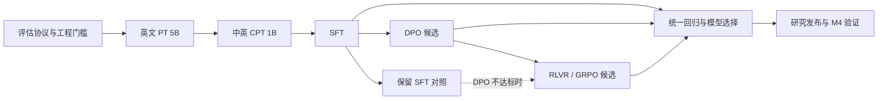

# d16 中英通用对话模型完整训练计划书

版本：v1.0 · 日期：2026-09-28 · 预算：研究验证，GPU 总预算约 ¥1,000–2,000。

编制依据：仓库 `84ac516c7223b69875bf1fce41491f711780e2af`、本次 d4 实验产物及本文链接的原始论文/官方文档。本文是训练与工程实施方案；附属配方仅进行了离线配置检查，没有启动新训练。

## 1. 决策摘要

**主方案：d16 / 230.8M / 4K → 50 亿英文预训练 → 10 亿中英继续预训练 → SFT → DPO → 小规模 RLVR → 回归评估与 M4 导出。**

优先级是基础语言能力、短对话、指令遵循、简单可验证任务。目标为英文为主、兼顾中文与中英混合的研究模型。GPT-2 Small 是英文基础能力的验证目标，不是已达成的事实，也不是预算内必然达到的保证。

推荐单张 H800 80GB 开始，Apple M4 负责数据抽样、日常评估和交互测试。当前代码只支持单 GPU；本预算不把 DDP/FSDP 或多机开发列为关键路径。

**预算纪律：**先实测 d16 吞吐，再冻结训练规模；为后训练和故障保留预算。阶段未通过门槛时，保留上一阶段模型并停止追加，不强行执行后续算法。完整计划覆盖所有阶段，不代表每个算法都必须作用到最终发布权重上。

主方案总计 60 亿 PT/CPT tokens；SFT、DPO、RL 另按各自真实输入/输出 token 数记账。¥1,000 缩减方案见第 14 节。

## 2. 已有证据与当前能力边界

| 项目 | 已确认事实 |
|---|---|
| 已训练模型 | d4，36,814,994 参数，其中非 token embedding 仅 3,719,314 |
| 训练量 | 3,815 steps，500,039,680 tokens，4K 上下文 |
| 训练收尾 | 最后一批 loss 4.2323；step 3,800 的周期性验证 loss 4.2061 |
| 本地评估 | 114 篇、105,884 tokens；1K BPB 1.2556，4K BPB 1.2538 |
| 数据边界 | 上述本地评估是原验证分区中日常监控前缀之外的新切片，不是独立外部测试 |
| 导入验证 | 最终 CUDA 权重已导入 MLX；两个短样本平均 NLL 差约 0.0021 / 0.0064 |
| 生成质量 | 固定贪心样例重复严重，基础知识/算术错误；采样也未解决事实可靠性 |
| 已有工程 | 单卡 PT/CPT/SFT、流式/缓存 Parquet、mmap、assistant mask、完整 CUDA checkpoint、MLX 导入、原文评分及交互 CLI |
| 尚缺工程 | GPT-2 标准对照、偏好数据处理、DPO、RL rollout/奖励/训练器、阶段预算停点与 checkpoint 保留策略 |

本次 d4 证明了训练与推理链路能运行。它不能单独证明架构优劣、达到 GPT-2、可用中英对话或 32K 长上下文能力。

本地实测详见 `artifacts/h800-d4-4k/EVALUATION.md`；该目录已被 Git 忽略，不能把缺少本地产物的克隆视为已经拥有模型。

现有运行入口见 [CUDA 环境与训练](cuda.md) 和 [Apple Silicon 导入、评估与交互 CLI](local_evaluation.md)。

## 3. 阶段关系：预训练、SFT、DPO 与 RL



- **PT/CPT：**学习语言、常识和任务相关分布。它决定后训练可利用的基础能力。
- **SFT：**从正确示范学习回答方式、结束行为、指令与多轮格式。
- **DPO：**用固定偏好对优化回答偏好，标准 DPO 不要求在线 rollout 或单独训练奖励模型。[DPO 原论文](https://arxiv.org/abs/2305.18290)
- **RLVR：**在线生成多个回答，以可执行验证器的结果优化策略。这里采用 GRPO 风格方法，不建立大型人工偏好奖励模型，也不以 PPO + critic 作为本轮主方案。[DeepSeekMath / GRPO](https://arxiv.org/abs/2402.03300)

推荐先 DPO 后 RLVR，是因为当前目标先需要通用回答行为，再尝试窄任务增益。**DPO 与 RL 不是必须依次叠加的固定生产线。**若 DPO 退化，RL 可以从通过门槛的 SFT 开始；若 RL 提高算术却破坏对话，则交付 SFT/DPO 候选。

如果实验要求“先 RL 再 DPO”，必须针对 RL 模型重新构造/检查偏好对、重设冻结 reference，再做短 DPO 修复实验；不能直接重放与旧模型分布脱节的偏好集，并宣称一定恢复通用能力。该分支消耗同一预算，不是免费追加阶段。

## 4. 冻结的模型方案

| 项目 | d16 配置 |
|---|---:|
| 总参数 | **230,803,270** |
| token embedding / 共享输出权重 | 99,287,040 |
| 非 token embedding | **131,516,230** |
| 层数与顺序 | 16；重复 GDN/GDN/SWA，合计 11 GDN + 5 SWA |
| 隐藏维度 / FFN | 768 / 2,304，SwiGLU |
| GDN | 9 heads，key dim 64，value dim 128，chunk 64，conv kernel 4 |
| SWA | 12 query heads，3 KV heads，head dim 64，window 1,024 |
| 位置 | GDN 无位置编码；SWA 使用现有 RoPE，theta 10,000，不额外扩展 |
| 训练/评估主上下文 | 4,096；正式 GPT-2 对照另固定共同上下文协议 |
| 权重精度 | BF16，控制参数按现有实现保留 FP32；优化器状态 FP32 |
| 权重体积 | 约 461.6 MB / 440.2 MiB，不含优化器与激活 |

使用当前 `config_for_depth(16)`，不修改 d12/512 的既有预设。d4 与 d16 宽度不同；现有加载规则不支持把 d4 权重直接扩成 d16，正式 d16 从随机初始化开始。

选择 d16 的原因：它有约 131.5M 非 embedding 参数，比本次 d4 的约 3.7M 更适合验证基础语言与对话能力；d20 则达到约 425.5M 总参数、293.1M 非 embedding 参数，会进一步挤占同一预算下的数据量和后训练时间。参数量只用于说明容量与预算取舍，不能推出准确的吞吐或 GPT-2 能力结论。

Tokenizer 与官方 Python prompt encoder 继续固定到 `deepseek-ai/DeepSeek-V4.1-Flash` 的仓库现有 revision `dba1be0a40aa45a94ad051997016db3960a90277`。记录 tokenizer JSON 与 encoder 的 SHA-256。PT 使用普通文本；SFT/DPO/RL 使用官方非 thinking 对话模式。不得用别的 tokenizer 或临时 Jinja 模板替换。

32K 仅保留工程上限，不纳入本预算的实际训练和能力验收。

## 5. 阶段总表

| 阶段 | 输入 | 主计划规模 | 产物 | 继续条件 |
|---|---|---|---|---|
| P0 工程/标定 | 当前代码、d4、GPT-2 Small | 本地检查 + 最多 3 H800 小时标定 | 冻结评估集、吞吐、预算、配置 | 工程验证通过、预算可容纳后续阶段 |
| P1 英文 PT | 随机初始化 d16 | 5B tokens；0.5B/1B/3B/5B 检查 | 英文 base checkpoints | 独立验证和基础任务有持续改善 |
| P2 中英 CPT | 选中的 P1 权重 | 1B tokens | 中英 base checkpoint | 中文改善，英文退化不超预登记界限 |
| P3 SFT | P2 或选中的 P1 | 20k 对话 pilot；约 100k 主集，初始 1 epoch | SFT 候选 | 指令遵循、终止、重复、事实检查通过 |
| P4 DPO | 冻结选定 SFT reference | 5k 偏好对 pilot；20k 主集，初始 1 epoch | DPO 候选 | 对 SFT 盲评有收益且无明显基础能力退化 |
| P5 RLVR | 通过门槛的 SFT/DPO | 200 updates pilot；最多 1,000 初轮 updates | RL 候选 | 可验证任务改善、无奖励作弊、通用能力回归通过 |
| P6 选择/导出 | 所有候选 | 统一冻结测试与 MLX 数值检查 | 选定权重、报告、可复现命令 | 全部结论与证据层一致 |

表中数据量是目标/上限，不是绕过门槛的执行承诺。P3–P5 的有效 token 数与吞吐必须单独测量。

## 6. 数据计划与版本契约

### 6.1 预训练与继续预训练

P1 使用现有 `karpathy/fineweb-edu-100b-shuffle`、revision `4c8f30d6756da75362432a4d5569e1b229263b71`。正式版本先构建稳定抽样、去重和评估排除清单，避免数据顺序或选择在运行中变化。

P2 按**本项目 tokenizer 处理后的 token 数**混合：英文回放 40%、中文 50%、可验证的简单数学/短解释 10%。这 1B CPT 对应约 500M 中文 tokens；不能把它当作已经充分训练的中文通用模型。

中文预训练候选为 `HuggingFaceFW/fineweb-2` 的 **`cmn_Hani`** 子集。官方数据卡标注 ODC-By 1.0 与 Common Crawl 使用条件；采样前固定具体 revision、文件清单和归因记录。[数据卡](https://huggingface.co/datasets/HuggingFaceFW/fineweb-2) · [子集表](https://huggingface.co/datasets/HuggingFaceFW/fineweb-2/blob/main/README.md)

数学部分优先自建有正确答案和可复核步骤的简单算术/逻辑文本；可选少量 `HuggingFaceTB/smollm-corpus` 的 Cosmopedia v2 教育文本，但合成文本并非自动正确，不能把其现成 token_length 当成 DeepSeek token 数。[SmolLM-Corpus 数据卡](https://huggingface.co/datasets/HuggingFaceTB/smollm-corpus)

工程上采用“固定文档混合顺序 → 分词 → 单一 mmap 数据集”，复用现有 loader。当前在线 streaming 只支持单一数据来源，不能把配方中的比例误认为已经存在的在线混合功能。现有 cached-Parquet 路径也不支持命名配置的多语子集，中文数据需要单独准备。

### 6.2 SFT 与偏好数据

| 用途 | 主候选 | 使用方式与已核实边界 |
|---|---|---|
| 英文 SFT | HuggingFaceTB/smol-smoltalk | 官方卡标注 Apache-2.0；选短回答和基础任务，仍审计各来源与去重 |
| 中文 SFT 研究分支 | BelleGroup/train_0.5M_CN | 选 10k–20k 高质量短样本；卡片虽有 GPL 标签，正文明确限研究用途，因此该分支按研究用途管理 |
| 中文补充候选 | m-a-p/COIG-CQIA | 质量有人工审查描述，但卡片 License 字段仍待补充；仅在具体子来源用途确认后纳入 |
| 可选中文替代 | BAAI/Infinity-Instruct | 卡片 CC-BY-SA-4.0，且当前文件访问有门槛；不假设已取得访问或同意条件 |
| 英文 DPO | HuggingFaceH4/ultrafeedback_binarized | 官方卡 MIT；使用 train_prefs 的短、可核验子集，不假设偏好标签全正确 |
| 中文/针对性偏好 | 选定 SFT 模型生成 + 规则/人工复核 | 同一 prompt 的 chosen/rejected，优先修复重复、错误确定性、答非所问、结束行为 |

来源：[smol-smoltalk](https://huggingface.co/datasets/HuggingFaceTB/smol-smoltalk)、[BELLE 使用限制](https://huggingface.co/datasets/BelleGroup/train_0.5M_CN)、[COIG-CQIA](https://huggingface.co/datasets/m-a-p/COIG-CQIA)、[Infinity-Instruct](https://huggingface.co/datasets/BAAI/Infinity-Instruct)、[UltraFeedback](https://huggingface.co/datasets/HuggingFaceH4/ultrafeedback_binarized)。

本计划默认研究用途。若未来目标转为商业发布，应另行选择适用于该目标的数据路线，不能把当前候选数据的公开下载等同于不受限制的使用许可。

### 6.3 清洗、切分与记账

1. 文档/会话/偏好 prompt 先做规范化哈希与近重复聚类，再按簇切分，避免改写或翻译版本跨 train/test。
2. PT/CPT 保留独立英文、中文 validation 与最终 test；建议各 1M–2M tokens，额外外域文本用来减少单一网页分布偏差。
3. SFT 保留约 2,000 条开发集与 600 条最终对话测试；DPO 保留至少 1,000 对 prompt-disjoint 偏好；RL 按模板族、数值范围与 seed 分离。
4. 所有阶段排除冻结基准的题干、答案、近重复与翻译变体；公开网页预训练的污染无法凭一次字符串检查完全排除，报告残余不确定性。
5. 禁止静默截断答案、静默替换角色、重复 BOS/EOS 或混用 thinking 模式。超长样本按预登记规则剔除或合理重分段，并记录数量。
6. 每批数据清单至少包含：source/revision/license_note、原始样本 ID、内容 SHA、split、语言、去重簇、tokenizer/encoder SHA、长度、assistant token 数、清洗原因、生成器/验证器版本。
7. 统计四种不同数量：唯一原始 tokens、重复训练 exposure、实际处理的输入 slots、参与 loss 的有效 targets。SFT/RL 不以 padding 或 prompt tokens 冒充监督量。

## 7. P0：先补工程与测真实成本

### 7.1 本地优先完成

- 接入 `lm-evaluation-harness` 的 `loglikelihood`、`loglikelihood_rolling` 与生成接口；MLX 运行本模型，成熟 GPT-2 实现作为对照。[官方模型适配接口](https://github.com/EleutherAI/lm-evaluation-harness/blob/main/docs/model_guide.md)
- 完成偏好数据格式、differentiable completion log-prob、奖励验证器和分阶段 checkpoint 设计的短数值测试。
- 验证 label shift、assistant mask、EOS、padding、无目标样本以及缓存/整段评分的一致性。正式 loss 必须保持词表投影分块，不产生完整 B×T×V 张量。
- 用极小固定数据做显式的小样本过拟合诊断，确认 loss 能明显下降、输出能记住目标。这是未来单独授权的训练诊断，不把它计入已完成的实现测试或通用能力证明。

### 7.2 H800 标定

先使用独立输出目录、独立随机初始化做 50–100 steps 短跑。比较 device batch 2/4/8、词表块 1,024/2,048、是否启用 block checkpoint。记录初次编译与稳定运行分别的时延、真实数据加载、峰值显存、温度/降频与完整 optimizer step 时间。

保留 PyTorch/FLA、BF16、fused loss 和已验证的局部编译路径。`--matmul-precision high` 会影响 FP32 矩阵计算方式，必须写入正式运行契约。不得把 d4 的设备吞吐直接作为 d16 的承诺。

正式训练按显存峰值留至少约 15% 余量选择 microbatch；具体能否达到 batch 4/8 由实测决定。先预算 3 GPU 小时，包含编译、学习率小范围检查、吞吐标定和恢复演练。

### 7.3 必须先解决的恢复问题

当前 `--resume` 要求总 steps、模型、microbatch、backend 和数据契约一致。不能先用 1B horizon 训练，随后直接把 training_tokens 改成 5B 并声称无缝续训。

主方案从开始就声明 **5B horizon（38,147 steps）**，在约 0.5B/1B/3B 进行检查。开跑前需要新增“在指定 step 边界保存完整状态后退出”的预算停点，且不改变原 scheduler horizon。该功能目前尚未实现，配方本身不提供它。

若只使用现有代码，短 pilot 必须是独立实验；正式 5B 从头开始。另一种现有可行方式是 `--init-from` 建立新阶段，但它会重置优化器、日程和数据游标，必须更换到明确的新数据切片并在报告中标注，不等同于 resume。

## 8. P1：英文预训练

附属配方：`configs/experiments/d16_research/pretrain_5b.json`。

| 超参数 | 初始方案 |
|---|---|
| 目标 | 5,000,000,000 tokens，实际按完整 step 向上取整至 5,000,003,584 |
| global batch | 131,072 输入 tokens / optimizer step |
| device batch 起点 | 4 × 4,096；累积 8 次，待显存/吞吐标定 |
| 优化器 | 现有 Muon + 辅助 AdamW 分组 |
| Muon / AdamW LR | 0.02 / 3e-4；在 pilot 检查 Muon 0.01/0.02，不在正式训练中追涨调参 |
| 动量 / AdamW betas | 0.95 / (0.9, 0.95) |
| weight decay / clip | 0.01 / 1.0 |
| 学习率 | warmup 2%，cosine 到初始 LR 的 10% |
| 初始化 / seed | 随机初始化，固定 seed 42；暂不要求昂贵的多 seed 完整训练 |

检查点约为 step 3,815 / 7,630 / 22,889 / 38,147。0.5B 对照 d4 能提供观察依据，但 scheduler horizon、学习率阶段等不同，所以不是纯粹的容量因果消融。

训练内每约 200–500 steps 做固定小验证，每个里程碑跑完整开发评估；最终 test 保持封存。保存间隔以实测写入耗时和最多可接受丢失的约 10–15 分钟计算量决定，而不是机械沿用每 100 步。

**停止/诊断条件：**非有限 loss/梯度立即停止；验证 BPB 相对近期最佳持续恶化超过 5% 且复核非数据变化；吞吐低于标定约 70% 持续 10 分钟；剩余预算无法覆盖下一个安全保存点。后两个阈值是本项目操作规则，不是模型理论结论。

1B 后如果基础任务仍接近随机、生成普遍崩塌，而且验证趋势停滞，暂停追加并检查数据/目标/优化。若指标仍有清楚进步，可以在冻结预算内继续；不能因单个算术样例失败就断言所有预训练无效。

## 9. P2：中英继续预训练

附属配方：`configs/experiments/d16_research/cpt_bilingual_1b.json`。

从选中的英文 base 权重 `--init-from`，使用新数据与新优化器。主计划 1B tokens，mix 为英文 40%、中文 50%、可验证数学短文本 10%。初始使用全参数 AdamW，LR 1e-4，warmup 2%，其余 clip、betas 与 weight decay 见配方。

每 50M–100M tokens 同时检查英文和中文开发集。英文 BPB 相对 P1 基线恶化超过 3% 且连续两次复核成立时，优先提高英文回放比例或降低 LR，形成新的明确实验版本。不能只看中文 loss 改善而忽略英文遗忘。

本阶段不是多语言能力保证。若中文能力仍弱，应如实把候选标注为英文为主，缩小中文承诺，而不是用聊天模板掩盖差距。

## 10. P3：SFT

### 10.1 数据规模与目标

先做约 20,000 条对话 pilot，再扩大到约 100,000 条筛选后对话。按 assistant targets 控制英文约 80%、中文约 20%，而不是简单按样本条数计比例。

建议任务配比：通用短问答/对话 35%、改写与摘要 20%、给定材料的阅读/抽取 20%、格式/约束 10%、简单算术与逻辑 10%、适当表达不确定性 5%。多轮样本可占约 15%–20%，作为与上述任务类型交叉的属性。

优先短、正确、明确结束的回答。大多数 assistant 回复控制在 16–256 tokens，总会话不超过 4K；第一轮不训练长思考轨迹、复杂工具调用或超出基础能力的大段代码生成。中文候选数据里的事实/算术错误需要筛除，不能仅以“中文流畅”判断标签正确。

### 10.2 训练方案

附属配方：`configs/experiments/d16_research/sft_pilot.json`。它是**最多 512 optimizer steps 的 pilot 上限**，不是承诺恰好 1 epoch；数据准备后必须重新确定实际步数。

- 权重：选定 CPT/base；`--source sft --init-from`，新 AdamW 状态。
- 全参数训练；初始 LR 5e-5，pilot 比较 2e-5 / 5e-5；warmup 5%，cosine 最低比例 0.1，clip 1.0。
- 4K，global batch 32,768 输入 slots；device batch 2 对应累积 4 次，batch 4 对应累积 2 次。
- 初始 1 epoch，最多 2 epochs 需要开发集和生成结果支持；不能因为 SFT loss 继续下降就无限重复。
- pilot 用于选配方；正式主集默认从同一个选定 CPT/base checkpoint 重新开始，避免把 pilot exposure 隐藏在“1 epoch”之外。若明确选择从 pilot 继续，必须计入累计 exposure 并冻结新日程。
- 使用仓库官方 encoder 的 assistant span mask；user/system/padding 不作为回答监督，assistant 结束符需要按既有契约监督。
- 现有 packing 会把完整会话放进同一记录，EOS 不自动重置 GDN 状态，也没有逐会话 attention 隔离。它是已有的 packing 语义，不能声称等价于每段独立。需要跨会话干扰测试；必要时改为每条会话独立记录并重新测成本。

每条 packed 记录含 4,097 tokens，训练输入为 4,096。若 `R=train.bin tokens/4097`，则这个 global batch 每步处理 8 条记录；约一轮为 `ceil(R/8)` steps。当前 loader 会回绕，最后一步可能重复至多 7 条记录，报告实际 exposure。pilot 取 `min(512, ceil(R/8))`，主训练重新按主集计算。

TRL 提供 assistant-only loss 的通用机制，但其标准路径依赖模板中的 generation 标记；本仓库使用官方 Python encoder 与现有 mask，不能假设换上 TRL 参数即可保留同样语义。[TRL SFT 文档](https://huggingface.co/docs/trl/sft_trainer)

### 10.3 SFT 验收

在固定开发集上检查：回答相关性、约束遵循、重复、是否自然结束、错误确定性、中英切换与多轮指代。初始项目目标是简单约束集合通过率至少 80%、明显循环重复样本比例低于 10%、因达到长度上限而截断的比例低于 10%。这些是进入后训练的操作门槛，不能当作全领域能力分数。

同时重跑基础能力回归。SFT 相对 base 的外域 BPB 恶化超过 5% 或标准任务出现明显退化时，检查数据质量、LR 与 epoch，选择较早 checkpoint。

## 11. P4：DPO 偏好优化

### 11.1 目标与数据

目标是改善相关性、正确性、简洁性、重复与结束行为。DPO 不承担补齐大规模世界知识的职责。

从 5,000 对 pilot 开始；主集约 20,000 对，初始 1 epoch，最多约 40,000 对 exposure。英文/中文先约 80/20，再按有效 completion tokens 和任务难度复查。留出至少 1,000 对独立 prompt。

每条记录包含相同 prompt、chosen、rejected、语言、偏好原因、标注来源、模型版本与正确性核验结果。过滤相同回答、两边都错误、偏好原因不明确的 pair。优先使用本阶段模型能理解的短答案，避免只因长度/措辞差异形成假偏好。

候选格式（规划格式，当前训练器尚不接受）：

```json
{"id":"pair-001","prompt":[{"role":"user","content":"What is 2 + 2?"}],"chosen":{"role":"assistant","content":"4."},"rejected":{"role":"assistant","content":"5."},"reason":"verifiable_correctness"}
```

不要把仅可机器识别的格式错误负例占满训练集。简单算术 pair 只能作为少量控制样本，不能拿偏好训练集自身准确率当作泛化证明。

### 11.2 损失与参数

冻结选定 SFT 为 reference。标准 sigmoid DPO 使用完整 completion 的 log-prob **求和**：

```text
margin = [log πθ(chosen|prompt) - log πθ(rejected|prompt)]
       - [log πref(chosen|prompt) - log πref(rejected|prompt)]
loss = -log sigmoid(beta × margin)
```

prompt 和 padding 被 mask；EOS 与 completion 边界一致。把求和偷偷换成 token 平均会改变目标，若实验要研究长度归一化，必须另起版本。[DPO 论文](https://arxiv.org/abs/2305.18290)

初始 AdamW LR 5e-6，pilot 范围 1e-6–1e-5；beta 0.1，候选 0.05/0.1/0.2；global batch 32 pairs，microbatch 1–2 pairs 起步；clip 1.0，warmup 5%，初始 1 epoch。每个 chosen/rejected 分支的 prompt+completion ≤4K，优先短于 2K。

候选范围是顺序诊断空间，不要求执行完整网格；所有 pilot 与主训练合计受 4 GPU 小时预留约束。正式主集默认从选定 SFT 重新开始，reference 保持同一 SFT；若从 pilot 接续，单独登记累计 pair exposure。

固定 reference 后可预计算 reference log-probs，缓存键必须包含 reference weights SHA、tokenizer、encoder、数据版本、completion mask 和截断规则。不能跨版本复用。[TRL DPO 文档](https://huggingface.co/docs/trl/dpo_trainer)

### 11.3 验收与故障检查

监控 chosen/rejected log-prob、隐式 reward margin、loss、回答长度、EOS 行为和开发偏好准确率。margin 上升不等于人类偏好改善；如果 chosen 的概率也明显下降或输出长度异常变化，需要检查过优化与长度捷径。

用固定 prompt 对 SFT/DPO 输出做盲评，随机左右顺序，平局按半胜计，同时报告正确性与长度分层。若 95% 配对 bootstrap 区间不能支持优于 SFT，则保留“无明确增益”的结论，默认选择 SFT；不因完成了 DPO 阶段就强行替换模型。

## 12. P5：RLVR / GRPO 风格实验

### 12.1 为什么限定为可验证任务

本轮用确定性正确性反馈测试强化学习，不训练大型 reward model/critic。任务从一两位数算术、短字符串变换、给定材料抽取、简单 JSON 结构与语义一致性开始。通用聊天的礼貌或事实可靠性不能靠一个数字验证器代表。

进入 RL 前，候选模型在选定难度任务上应已有约 10%–70% 的 pass@1；先生成 200–500 个 prompts 的多样本诊断。如果几乎全错，先补相关 SFT；如果几乎全对，增加任务难度。全组同奖的样本不提供有效相对优势，不能靠增加训练步数解决。

### 12.2 可执行奖励

任务成功奖励 1，失败奖励 0。格式只是正确答案能被验证的必要条件，不单独给“看起来像 JSON”或冗长解释正奖励。答案验证应覆盖完整输出，避免从一串互相矛盾的答案中碰巧抽到正确数字。

用受限解析器和确定性函数验证，不能对模型输出直接调用 Python `eval`。第一轮不把执行任意生成代码纳入奖励环境。训练/开发/test 使用不同模板族、seed 和数值范围，另外保留适度分布外组合。

保留 EOS mask 与截断标志；达到最大生成长度仍未正常完成的输出不冒充成功。记录奖励程序 SHA、题目生成器 SHA、正确答案与每个候选的验证详情。

### 12.3 算法与初始参数

- 起点：通过门槛的 DPO，或 DPO 未达标时的 SFT。冻结同一起点作为 KL reference。
- 每次更新 8 prompts，每个 prompt 生成 G=4 个回答，初始最多 128 new tokens。
- sampling temperature 0.8 起步；种子、采样策略与 rollout policy 版本记录完整。
- AdamW LR 1e-6，pilot 范围 5e-7–5e-6；clip 1.0；importance ratio clip epsilon 0.2；KL beta 0.02，候选 0.01–0.05。
- 每轮 rollout 初始只做一次策略更新，避免反复使用过旧样本。
- pilot 200 updates，初轮最多 1,000 updates；只有预算与效果允许才提高生成长度或组大小。

每组根据奖励计算中心化、标准化优势；奖励标准差为零的组按零优势处理并单独统计。旧策略 log-prob 来自生成这些样本的策略；冻结 reference 用于 KL。二者不是同一个概念，不能混用。

采用明确的 token 归一化 clipped objective，而不依赖某个库随版本变化的默认值：

```text
ratio = exp(current_logprob - rollout_old_logprob)
policy_term = min(ratio × advantage, clip(ratio, 0.8, 1.2) × advantage)
loss = - sum(completion_mask × policy_term) / sum(completion_mask)
       + beta_kl × mean_valid_completion_token_KL
```

分母覆盖当前更新的全部有效 completion tokens；prompt/padding 不进入目标。若用采样 KL 估计，明示估计方法、nats/token 单位与 reference，不能把它当成完整分布上的精确 KL。此处为 GRPO 风格、token 归一化的具体变体，报告时必须写出配置；不同长度归一化方式会改变训练行为。[GRPO 原论文](https://arxiv.org/abs/2402.03300) · [TRL 对 GRPO/DAPO 等损失的说明](https://huggingface.co/docs/trl/grpo_trainer)

### 12.4 规模与成本口径

200 updates × 8 prompts × 4 samples × 128 tokens = **最多 819,200 generated tokens**；1,000 updates 对应最多 4,096,000。还要计算 prompt prefill、reference/policy 评分、反向和验证时间。

必须单独测量“组采样的 aggregate generated tokens/s”。例如同样 4.096M 输出 tokens，500 tokens/s 与 2,000 tokens/s 仅解码就分别约 2.28 小时与 0.57 小时；这不是已测速度，也不含其他开销。预训练 tokens/s 不能用于估算 RL 总耗时。

本轮给 RLVR 预留最多 8 GPU 小时。超过预算则减少 updates/样本数，保持验证器和评估质量。

### 12.5 防止错误结论

记录 pass@1、pass@4、reward 均值、零优势组比例、KL、entropy、clip fraction、输出长度与截断率。比较训练前后相同温度和采样次数的结果，不能用训练后 pass@4 对比训练前 pass@1。

操作性停止门槛：非有限梯度立即停止；KL 持续超过约 0.1 nats/token、明显长度失控、验证器被投机利用、或开发成功率回落且通用对话退化，暂停并选择较早 checkpoint。这些阈值需在 pilot 结束、正式 RL 前登记。

只有独立验证器测试的增益和通用回归共同通过，才选择 RL 版本。必要时保留 DPO 或 SFT 为最终研究模型。

## 13. 评估体系与阶段门槛

### 13.1 固定评估矩阵

| 层次 | 指标/任务 | 运行方式 |
|---|---|---|
| 数值与实现 | 权重指纹、loss/gradient、缓存一致性、EOS/mask、恢复一致性 | 每次工程变更；短序列为主 |
| 英文基础 | 外域 raw-text BPB；HellaSwag、PIQA、LAMBADA | 原始 base prompt，标准候选评分，与 GPT-2 Small 同协议 |
| 中文基础 | 独立中文 BPB、基础阅读/抽取/改写 | 单独报告，不与 GPT-2 英文基线混成一个分数 |
| 对话与指令 | 固定约 600 prompts，建议英文 400、中文 150、中英混合 50 | official chat template；20% 左右含多轮或组合约束 |
| 生成缺陷 | 循环重复率、空答/截断率、格式成功、事实错误、不确定性表达 | 固定 raw 与 chat 两套提示，greedy 与固定 sampling 分开 |
| 偏好 | 与 SFT/上一候选的盲评、长度分层胜率 | 不把 DPO 训练 margin 当成胜率 |
| RL | 生成器外 held-out 任务、pass@1/pass@4、验证器完整性 | 同等推理预算，检查过拟合与奖励捷径 |
| 本地可用性 | M4 prefill/decode、峰值分配/RSS、交互结束 | 每个最终候选；不从权重大小推断全部运行内存 |

HellaSwag 报告预登记的标准指标（例如 acc_norm）及任务版本，PIQA 报告对应标准准确率；LAMBADA 明确所用任务变体。适配器需要正确处理 prompt/completion token 边界，不能直接复用现有 chat_eval 的单字母 logits 评分。

### 13.2 怎样声明“达到 GPT-2 Small”

实际运行固定 revision 的 GPT-2 Small 权重，冻结 harness commit、task 配置、数据 revision 与解码协议。对 raw-text 对照使用相同文本和共同截断规则；两个 tokenizer 的同样 1,024 tokens 并不天然表示同样文本长度。

要求三个主任务的点估计均不低于 GPT-2，同时报告配对差异的 95% 区间。若区间跨 0，最多写“点估计达到，统计证据不足”；若部分任务低于基线，给出分项结论，不能概括为全面达到。FineWeb BPB 可能偏向使用同分布训练的数据，必须有外域与标准任务作为补充。

历史上有 124M GPT-2 架构在 10B FineWeb tokens 上达到公开 GPT-2 Small HellaSwag 水平的复现；它是参考，不是我们的 hybrid 在 6B tokens 上一定达标的依据。[原始复现实验](https://github.com/karpathy/llm.c/discussions/481)

### 13.3 门槛的执行规则

本文的 3%/5% 回归、80% 简单约束等数值是项目初始决策规则，不是文献保证。先用 P0/pilot 检查测试难度和测量方差，再在正式阶段开始前冻结。不得看完最终测试再调整门槛。最终 test 不用于选 LR、挑数据或反复选 checkpoint；阶段选择用开发集，最终 test 用于结论。

## 14. GPU 时间、费用与缩减方案

### 14.1 预算模型

按用户本次 AutoDL 页面显示的历史单价 **¥10.50 / H800·小时**计算，并非新租用时的实时报价。d16 尚未做实测。以下用 15k/30k/60k processed tokens/s 作为成本敏感性情景；30k 接近早先的参数比例外推，不是性能承诺。

PT/CPT 的 6B 数据量额外加 15% 用于训练内保存/验证/数据波动。其余 GPU 时间预留：标定 3h、SFT 4h、DPO 4h、RLVR 8h、独立评估与恢复检查 9h，共 **28h**。这些是阶段预算上限，不是预言每项恰好需要这么久。

```text
PT/CPT 小时 = (5B / r_PT + 1B / r_CPT) / 3600 × 1.15
直接 GPU 成本 = (PT/CPT 小时 + 28) × 单价
预算余量 = max(¥200, 直接 GPU 成本 × 20%)
预算总额 = 直接 GPU 成本 + 预算余量
```

| 假设 PT 与 CPT 均为 | PT/CPT 含 15% 余量 | 加 28h 后的直接 GPU 费 | 故障/波动预算余量 | 合计 |
|---|---:|---:|---:|---:|
| 15k tokens/s | 127.78h | ¥1,635.67 | ¥327.13 | **¥1,962.80** |
| 30k tokens/s | 63.89h | ¥964.83 | ¥200.00 | **¥1,164.83** |
| 60k tokens/s | 31.94h | ¥629.42 | ¥200.00 | **¥829.42** |

表中不包括人工工程、人工标注、付费 teacher/judge API、额外存储与传输费用。默认不依赖付费 teacher；如果选择付费生成/评判，单独列出成本，不能从本表推导“全部项目只要这些钱”。新实例的实际单价变化后重新计算。

### 14.2 ¥1,000 严格上限

先留 ¥294 对应 28 GPU 小时，再留至少 ¥200 故障预算。可用于 PT/CPT 的直接费用约 ¥506。

- 若实测约 30k tokens/s，PT/CPT 总量上限约 **4.53B**；建议 **3.5B 英文 + 0.5B CPT**，留一点余量。
- 若实测约 15k tokens/s，总量上限约 **2.26B**；建议 **1.75B 英文 + 0.5B CPT**。
- 后两种方案仍可安排所有阶段的研究级 pilot，但基础能力可能不足以通过 DPO/RL 门槛。低预算不等于保证 GPT-2 或完整双语对话达标。

通用公式（假设 PT/CPT 吞吐相同）为：

```text
可用直接成本上限 = min(总预算 - 200, 总预算 / 1.2)
PT/CPT tokens 上限 = (可用直接成本上限 - 28 × 单价)
                    / (1.15 × 单价) × 吞吐 × 3600
```

选择最终 token horizon 必须发生在正式训练前；缩减后生成新的配方与 manifest，不能在 resume 时静默改变总 steps。

### 14.3 多卡的定位

当前预算先单卡。未来若时间比成本更重要，可在 DDP 完成、数据分片/全局梯度归一化/恢复测试通过后比较 2/4 卡；同时检查同机拓扑与 NCCL。多卡节省墙钟时间不必然节省 GPU 总费用，本表不使用未经测量的多卡加速比。

## 15. 工程实施清单与日程

| 任务 | 当前状态 | 必须完成的验收 |
|---|---|---|
| E0 标准评估 | 部分：raw BPB 已有 | GPT-2 与 hybrid 使用同样 task；候选 log-prob 对照短 oracle；污染/边界检查 |
| E1 数据准备 | 单源及 SFT packing 已有 | 固定中英混合、去重、held-out、tokens/exposure 账本与 SHA |
| E2 预算停点与保留 | 尚缺 | 不改 horizon 的 step 边界停机；完整保存/校验；按预算保护；恢复一致 |
| E3 DPO | 尚缺 | differentiable completion log-prob、pair mask、冻结 reference、cache invalidation、目标/梯度短 oracle |
| E4 RL rollout | 只有基础生成 | EOS/截断/old log-prob/policy version、G 采样、可复现 RNG、分组数据 |
| E5 RL objective | 尚缺 | ratio 初始接近 1、全组同奖不产生 NaN、正确 mask/归一化/KL、verifier 反例测试 |
| E6 后训练 checkpoint | 尚缺阶段契约 | phase、reference SHA、reward SHA、optimizer/RNG/data/rollout 状态及明确恢复限制 |
| E7 导出/回归 | MLX 导入与 CLI 已有 | 新 d16/SFT/DPO/RL 权重逐阶段导出短验证，保留最佳而非最后版本 |

优先实现原生 PyTorch 后训练模块，复用当前模型/FLA/数据契约。现有模型不是 Hugging Face `PreTrainedModel`，官方 encoder 也不是通用 Jinja 模板，**不能直接复制一条 TRL/vLLM 命令就声称可运行**。若选择 TRL 集成，需额外补模型、generation、tokenizer/mask 适配，固定兼容版本并完成梯度与 checkpoint 验证。当前仓库没有这些依赖或接口。

建议的模块边界是 `nanochat_cuda/preference.py`、`posttraining.py`、`rollout.py`、`rewards.py`，CLI 放 `scripts/`，测试覆盖 CPU 短 oracle 与真实 CUDA；这些文件名是设计建议，尚未实现。

初次工程准备粗排约 **4–8 个有效工作日**，包含评估适配、DPO/RL、数据和恢复测试，实际取决于兼容问题与人工审查。云端阶段在 30k 情景约 92 GPU 小时，在 15k 情景约 156 小时；这是串行 GPU 占用量，不含本地工程日程。整体按约 **1–2 周研究迭代**安排，不能把 GPU 小时当作全部交付时间。

推荐顺序：本地完成大部分 E0/E1/E3/E5 → 短 GPU 标定与 E2/E6 恢复 → 冻结预算 → PT/CPT → SFT → DPO → RL pilot → P6。准备代码、下载和标注时不让付费 GPU 空转。

## 16. 存储、checkpoint 与失效恢复

- 6B uint32 tokens 约 24 GB；SFT token+label、原始缓存、偏好/rollout、模型状态另计。
- d16 完整训练 checkpoint 粗估 Muon 混合阶段约 2.7 GB、全参数 AdamW 阶段约 3.23 GB：BF16 权重之外，还有每参数 FP32 master 与一份 Muon momentum 或两份 AdamW moments。以实际文件为准，不能只按 440 MiB 权重估算。
- 推荐约 100–150 GB 可用数据空间。50 GB 方案必须做受控的分片缓存和保留策略，先核实实际峰值，不能照搬保留全部 checkpoint 的当前行为。
- 计划保留最近两份完整可恢复 checkpoint、一个阶段最佳完整版本；里程碑可另外保留仅推理权重。删除/清理前须验证新备份和清单，优先可恢复清理。
- checkpoint 元数据最后提交；保存模型、FP32 optimizer、scheduler horizon/step、数据游标、RNG、代码/依赖/data/tokenizer SHA。
- DPO 另存 reference 指纹与偏好游标；RL 另存奖励版本、rollout 版本和状态。第一版只在完整 rollout/update 边界保存，避免声称可恢复半个 rollout。
- 预算到点先保存并校验，再取回关键产物，最后关机。平台定时关机是保护措施，不替代训练器安全停点。
- M4 只需要模型/tokenizer/配置即可推理；优化器和 RNG 单独归档，不能声称 CUDA optimizer 已被转换为 MLX optimizer。

## 17. 日志与实验登记

每个 run 创建不可覆盖的目录和 manifest：run_id、parent checkpoint SHA、代码 commit、依赖锁文件 SHA、硬件/驱动、完整解析配置、数据/模板版本、seed、已授权预算、实际单价、阶段门槛。

PT/CPT 记录 loss、验证 BPB、有效 tokens/s、gradient norm、clip 频率、LR、显存、加载/保存时间；SFT 加 assistant token 比例与 epoch/exposure；DPO 加 pair margin/长度/胜率；RL 加 group rewards、old/reference log-probs、KL、entropy、截断与 verifier 统计。

每次里程碑保留同一组固定样例，不只保存表现好的结果。记录失败、回滚、未通过阶段和花费。训练 loss、实现正确性、正式能力、可用对话和发布状态分别报告。

## 18. 附属配方与当前可执行检查

以下命令仅打印计划，不加载 GPU、不下载数据、不开始训练。配方均为保守内存起点，正式选定 microbatch、checkpointing 和 backend flags 后冻结版本。

```bash
# P1: 英文 5B horizon
uv run python -m scripts.train_cuda \
  --recipe configs/experiments/d16_research/pretrain_5b.json \
  --device-batch-size 4 --compile --fused-loss --matmul-precision high \
  --dry-run

# P2: 新阶段，权重初始化；实际数据需要事先准备
uv run python -m scripts.train_cuda \
  --recipe configs/experiments/d16_research/cpt_bilingual_1b.json \
  --device-batch-size 4 --init-from /checkpoints/d16-pt/selected.json \
  --compile --fused-loss --matmul-precision high \
  --data-dir /data/d16-cpt --dry-run

# P3: SFT pilot 上限；实际步数需按 packed records 修正
uv run python -m scripts.train_cuda \
  --recipe configs/experiments/d16_research/sft_pilot.json \
  --source sft --init-from /checkpoints/d16-cpt/selected.json \
  --compile --fused-loss --matmul-precision high \
  --device-batch-size 2 --data-dir /data/d16-sft --dry-run
```

P4/P5 只有 `plan.json` 中的设计参数，目前没有可执行 trainer 配方或启动命令。不得将它当作 `scripts.train_cuda` 的可识别配置。真正开跑前需完成第 15 节工程验收，并按仓库要求显式选择训练执行开关。

## 19. 阶段交付与最终选择

每个阶段交付：完整配置、数据 manifest、权重与哈希、可恢复状态、阶段评估报告、累计费用和失败记录。

最终交付：

1. 选中的研究模型及 tokenizer/encoder 契约，清楚标注 base/SFT/DPO/RL 阶段和用途限制。
2. GPT-2 同协议基础评测、中文与对话评测、偏好与 RL 结果，注明置信区间及未验证能力。
3. 与上一阶段相比的增益/退化，不要求最后一个算法的权重必然获选。
4. M4 导入、一致性检查、交互 CLI 和性能记录。
5. GPU 小时与费用账本；未执行阶段及原因。

**本计划的成功标准是得到可解释、可复现的能力改善结论，并在预算内完成有意义的阶段实验。**若预算内模型未达到 GPT-2 或中英通用对话目标，交付明确的差距与停止证据，不能把“流程全部跑过”包装为能力达标。

## 20. 资料与维护

算法与接口依据为 [DPO 论文](https://arxiv.org/abs/2305.18290)、[DeepSeekMath/GRPO](https://arxiv.org/abs/2402.03300)、[TRL SFT](https://huggingface.co/docs/trl/sft_trainer)、[TRL DPO](https://huggingface.co/docs/trl/dpo_trainer)、[TRL GRPO](https://huggingface.co/docs/trl/grpo_trainer) 及 [lm-evaluation-harness 接口](https://github.com/EleutherAI/lm-evaluation-harness/blob/main/docs/model_guide.md)。动态文档在实施时固定到具体版本；本文不指定未经本项目验证的新依赖版本。

代码事实优先于本计划。若预算、数据许可、目标语言、硬件或正式吞吐改变，先修订 plan manifest、配方和验收门槛，再开始新的运行；保留旧计划版本用于复盘。

本次交付检查：三条附属配方的 CLI dry-run 通过，分别解析为 38,147 / 7,630 / 512 steps，确认检查过程未导入 Torch/MLX；参数量、数据比例、阶段步数与预算计算交叉核对通过。现有仓库测试为 158 passed、6 skipped（CUDA 条件测试）、1 条既有 Starlette 弃用警告。以上验证不构成 d16 吞吐、DPO/RL 实现或新训练结果。
